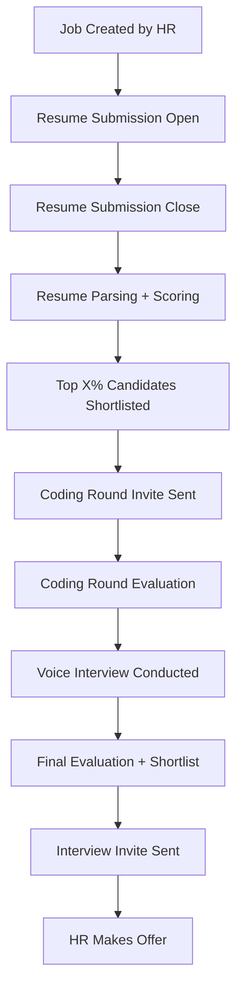

# 🤖 AI-Powered Hiring Assistant

An end-to-end **AI-driven hiring automation platform** that solves real-world recruitment bottlenecks using **multimodal intelligence, automated scheduling, resume parsing**, and **voice-based coding interviews**.


---

## 🧩 Problem It Solves

Modern hiring processes are often:

* ⌛ Time-consuming for HR to screen hundreds of resumes manually.
* ❌ Subject to bias or inconsistency in candidate evaluation.
* 📅 Prone to scheduling conflicts.
* 🔄 Inefficient in follow-ups and round management.

### ✅ Our Solution

A **fully automated agentic assistant** that:

* Parses resumes and matches them intelligently with job requirements.
* Scores candidates using LLMs + domain-specific evaluators.
* Manages the entire hiring workflow: resume submission, coding rounds, interviews.
* Schedules phases and sends emails automatically.
* Conducts voice-based coding interviews.
* Provides HR dashboards with real-time analytics.

---

## 🚀 Features

### 👩‍💼 HR/Admin Panel

* Create jobs with start/end times for all phases
* Define job requirements, positions, skills, experience, etc.

### 👨‍💻 Candidate Panel

* Apply to job roles with resume upload
* Receive emails for coding/interview rounds
* Take voice-based coding assessments

### 🔁 Full Workflow Automation

* Managed via APScheduler
* Automatic transition from resume to coding to interviews
* Sends emails at each step to shortlisted candidates

### 📄 Resume Evaluation

* Extracts structured data using Google Gemini
* Matches resumes with JD using:

  * FuzzyWuzzy
  * Sentence Transformers (semantic matching)
  * Scikit-learn vectorization

### 🧠 AI-Based Code & Voice Evaluation

* Voice transcription + LLM scoring
* Auto-generated coding feedback
* Shortlists top X% based on custom scoring logic

### 🖥️ Admin Dashboard

* Monitor submissions
* View scores
* Track pipeline progress

---

## ⚙️ Tech Stack

### 🔧 Backend

* **Python** 3.9+
* **FastAPI** (API Framework)
* **Uvicorn** (ASGI Server)
* **Pydantic** (Data validation)
* **Pymongo + BSON** (MongoDB integration)
* **python-dotenv** (Secrets)
* **APScheduler** (Workflow automation)
* **aiosmtplib** (Email service)
* **Google Generative AI (Gemini)** (Resume parsing, scoring)
* **Scikit-learn** (Vector-based scoring)
* **FuzzyWuzzy + Python-Levenshtein** (Fuzzy string matching)
* **Sentence-Transformers** (Semantic matching)

### 💻 Frontend

* **React.js** (SPA)
* **Tailwind CSS** (Styling)

---

## 🔄 Hiring Workflow



---

## 🧪 How the Automation Works

The `scheduler.py` handles time-based events:

* `resume_start` ➝ Log and open submissions
* `resume_end` ➝ Parse resumes, compute scores, email top candidates
* `coding_start` ➝ Notify candidates and accept submissions
* `coding_end` ➝ Evaluate coding responses (LLM-based), rank them
* `interview_start` ➝ Schedule voice-based interviews, email invites

### 🔔 All events auto-triggered with `APScheduler` + MongoDB stored timings.

---

## 🛠️ Setup Instructions

```bash
# 1. Clone the repo
$ git clone https://github.com/your-username/ai-hiring-assistant.git
$ cd ai-hiring-assistant

# 2. Install Python dependencies
$ python -m venv venv
$ source venv/bin/activate
$ pip install -r requirements.txt

# 3. Set environment variables
$ cp .env.example .env
# Add keys for: MONGO_URI, GEMINI_API_KEY, SMTP credentials

# 4. Run the backend
$ uvicorn main:app --reload

# 5. Run the frontend (React)
$ cd frontend
$ npm install && npm run dev
```

---

## 🧠 Intelligence Modules

* **Resume Scoring**: Hybrid of fuzzy, semantic, and rule-based scoring.
* **LLM Evaluation**: Uses Gemini + prompt engineering to extract data and assign match score.
* **MCP Integration**: Planned module for self-improving candidate scoring using continuous feedback.

