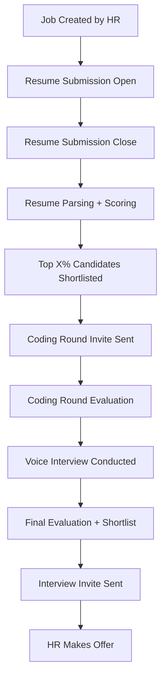

# 🤖 hiroBOT : AI-Powered Hiring Assistant

> **Streamlining recruitment with intelligent automation.**

<table style="width: 100%; border-collapse: collapse;">
  <tr>
    <td style="vertical-align: top; padding-right: 30px; width: 60%;">
      <h2 style="margin: 0;">An end-to-end <strong>AI-driven hiring automation platform</strong>.</h2>
      <p>
        Solving real-world recruitment bottlenecks using:
        <br>✅ <strong>Multimodal intelligence</strong>
        <br>✅ <strong>Automated scheduling</strong>
        <br>✅ <strong>Resume parsing</strong>
        <br>✅ <strong>Voice-based coding interviews</strong>
      </p>
    </td>
    <td style="vertical-align: top; text-align: right; width: 40%;">
      
    </td>
  </tr>
</table>

---

## 🧩 Problem It Solves

Modern hiring processes are often:

- ⌛ **Time-consuming**: Manual resume screening.
- ❌ **Bias-prone**: Inconsistent evaluations.
- 📅 **Scheduling conflicts**: Between phases.
- 🔄 **Workflow inefficiencies**: Manual follow-ups and coordination.

---

## ✅ Our Solution

A **fully automated AI assistant** that:

- 🧠 Parses resumes and matches them to job descriptions.
- 📊 Scores candidates using LLMs + domain evaluators.
- 🔁 Manages the entire workflow: submission ➝ coding ➝ interviews.
- 📬 Sends timely emails automatically at each step.
- 🎙️ Conducts voice-based and coding interviews.
- 📈 Provides real-time analytics and dashboards to HR.

---

## 🚀 Features

### 👩‍💼 HR/Admin Panel

- Create job posts with timelines for each phase.
- Define roles, skills, experience, and more.
- View pipeline and performance in real-time.

### 👨‍💻 Candidate Panel

- Upload resume and apply to roles.
- Receive auto-triggered emails for coding/interview rounds.
- Give voice-based assessments directly.

### 🔁 Workflow Automation

- Powered by **APScheduler**
- Handles phase transitions and notifications
- Keeps hiring flow moving with zero manual input

### 📄 Resume Evaluation

- Extracts structured info with **Google Gemini**
- Matches resumes with JDs using:
  - 🔤 FuzzyWuzzy
  - 🔍 Sentence Transformers (semantic similarity)
  - 📐 Scikit-learn vector scoring

### 🧠 Code & Voice Evaluation

- 🎧 Transcribes voice and uses LLMs to assess
- 🧪 Evaluates code quality automatically
- 🔝 Shortlists top candidates using scoring logic

### 🖥️ Admin Dashboard

- Monitor real-time candidate flow
- View scores & progress across stages
- Export reports and shortlist data

---

## ⚙️ Tech Stack

### 🔧 Backend

- Python 3.9+
- FastAPI (API Framework)
- Uvicorn (ASGI Server)
- Pydantic (Data validation)
- Pymongo + BSON (MongoDB)
- python-dotenv (Secrets management)
- APScheduler (Workflow automation)
- aiosmtplib (Email service)
- Google Gemini API (Resume parsing, scoring)
- Scikit-learn, FuzzyWuzzy, Sentence Transformers (Scoring)

### 💻 Frontend

- React.js (Vite-based SPA)
- Tailwind CSS (Utility-first styling)
- Recharts (Visualizations)
- Axios (API requests)

---

## 🔄 Hiring Workflow



---

## 🔁 Automation System

🕹️ `scheduler.py` handles everything!

| Event            | Action                                               |
|------------------|------------------------------------------------------|
| `resume_start`   | Opens submission phase                               |
| `resume_end`     | Parses + scores resumes, sends emails                |
| `coding_start`   | Notifies candidates, accepts code                    |
| `coding_end`     | Evaluates, ranks submissions                         |
| `interview_start`| Schedules voice interviews                           |
| `interview_end`  | Final shortlisting                                   |

All triggers managed via **APScheduler + MongoDB timestamps** 🧠

---

## ⚙️ Setup Instructions

```bash
# 1. Clone the repo
git clone https://github.com/your-username/ai-hiring-assistant.git
cd ai-hiring-assistant

# 2. Install backend dependencies
python -m venv venv
source venv/bin/activate
pip install -r requirements.txt

# 3. Configure environment variables
cp .env.example .env
# Fill in: MONGO_URI, GEMINI_API_KEY, SMTP credentials

# 4. Run the backend
uvicorn main:app --reload

# 5. Run the frontend
cd frontend
npm install
npm run dev
```

---

## 🧠 Intelligence Modules

### 📄 Resume Scoring

Combines:
- 🔤 Fuzzy string matching (`fuzzywuzzy`)
- 🔍 Semantic similarity (Sentence Transformers)
- 📐 Rule-based scoring (Scikit-learn)

### 🧠 LLM Evaluation

- Uses **Google Gemini API** for:
  - Content understanding
  - Candidate response grading

### 🔄 Self-Learning (Coming Soon)

- 📊 Historical learning from top hires
- 🧠 Builds Machine Comprehension Profile (MCP)

---

## 📬 Contact & Contribution

Want to improve hiring? Like automation? Join us!

- ⭐ Star the repo
- 🛠️ Open pull requests
- 🐛 Report bugs via issues
- 💬 Suggest new features

> _Made with ❤️ by developers, for recruiters._
